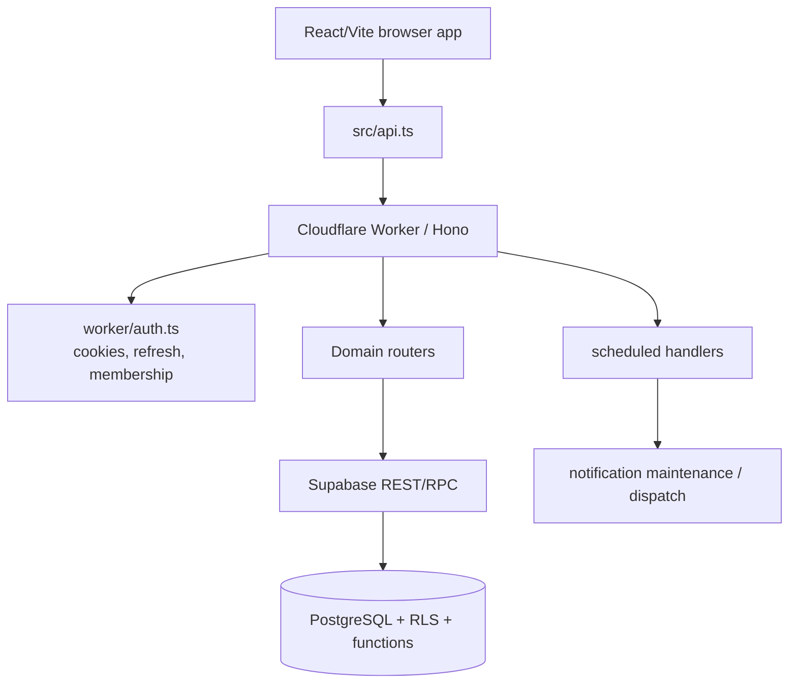

# Mimari gözlem raporu — 2026-09-19

Bu rapor koordinatörün sonraki planlama kararlarında kullanması için yazılmış
**observation-only** bir değerlendirmedir. Görev, kabul, sahiplik, readiness veya
merge otoritesi değildir; `PROJECT_STATE.md`, `TASKS.md`, `ROADMAP.md`, faz
kartları ve Issue #65 üzerindeki canlı koordinasyonun yerine geçmez.

## Okunan kaynaklar ve sınır

- `README.md`
- `AGENTS.md`
- `CONTRIBUTING.md`
- `PROJECT_STATE.md`
- `PRODUCT_SPEC.md`
- `ROADMAP.md`
- `TASKS.md`
- `docs/plan/architecture-contracts.md`
- `docs/plan/phase-13.md`
- `docs/plan/phase-14.md`
- `docs/plan/phase-17.md`
- `package.json`
- `.github/workflows/ci.yml`
- `vite.config.ts`
- `src/main.tsx`
- `src/api.ts`
- `src/App.tsx`
- `worker/app.ts`
- `worker/entry.ts`
- `worker/index.ts`
- `worker/auth.ts`
- `worker/bookings.ts`
- `worker/availability.ts`
- `worker/f11-group-management-http.ts`
- `worker/public-rpc.ts`
- `scripts/ci-code.mjs`
- `scripts/ci-postgres-plan.json`

Kod veya görev durumu değiştirilmedi. Bu rapor, mevcut dosya yapısı ve okunan
kaynaklara dayalı mimari/delivery gözlemidir.

## Kısa sonuç

Proje basit bir React uygulaması değil; üç yüzeyli randevu operasyon ürününü tek
backend ve ortak veri modeli üzerinde tutan, domain bütünlüğünü büyük ölçüde
PostgreSQL/Supabase tarafında kesinleştiren bir MVP platformudur.

Mimarinin güçlü yanı, tenant/üyelik, booking, idempotency, recovery, public
capability ve notification outbox gibi yüksek riskli kuralların sadece UI
konvansiyonlarına bırakılmamasıdır. Ana risk ise ürün fazları F13-F16'ya
ilerledikçe shared route, API contract, takvim hot-path ve mali/adisyon domain
modelinin aynı anda büyüyecek olmasıdır.

## Ürün yüzeyleri

| Yüzey | Durum / anlam | Mimari not |
| --- | --- | --- |
| Müşteri paneli | Public salon, hizmet seçimi, saat, rezervasyon, güvenli yönetim akışı | `src/PublicSalonPage.tsx`, `src/PublicBookingPage.tsx`, `src/ManageAppointmentPage.tsx`; public/capability Worker yolları farklı güvenlik sınıfında |
| Randevu paneli | Operatörün takvim, randevu, müşteri, ekip, katalog ve müsaitlik yüzeyi | `src/CalendarPage.tsx`, `src/BookingPage.tsx`, `src/CustomersPage.tsx`, `src/TeamPage.tsx`, `src/AvailabilityPage.tsx`; F13 ile ana çalışma yüzeyi daha kritik olacak |
| SalonApp / KolayApp | Mobil işletme kabuğu; adisyon/tahsilat/stok/kasa fazlarına zemin | `src/kolayapp/**` shell var; üretim route/session/business entegrasyonu F14'e bağlı |
| Marketing | Ayrı track; MVP ürün görev sayısına dahil değil | `docs/brand/**`, MKT-01; production renderer/cutover ayrı kabul bekler |

Üç ürün yüzeyi ayrı backend veya ayrı randevu motoru değildir. `Business` tenant
köküdür; yetki Supabase Auth, aktif `Membership`, RLS ve endpoint/RPC guard
zinciriyle doğrulanır. Client business seçimi veya cookie tek başına authority
değildir.

## Runtime mimarisi

### Frontend

- `src/main.tsx` manuel pathname switch ile ekran seçiyor. React Router yok.
- `src/api.ts` ortak fetch katmanı: JSON, `Accept`, `Content-Type`, CSRF token,
  retry, timeout ve `Retry-After` okuma burada.
- Sayfa component'leri domain bazlı ayrılmış: booking, calendar, availability,
  customers, team, onboarding, public booking/profile, management link.
- CSS dosyaları faz/yüzey bazlı ayrılmış; ortak shell ve route büyümesi
  başladığında global CSS ve nav etkileşimleri daha hassas hale gelecek.

### Worker/API

- `worker/entry.ts` Cloudflare entrypoint; fetch'i Hono app'e geçiriyor,
  scheduled event'te deployment heartbeat, notification maintenance ve dispatch
  başlatıyor.
- `worker/app.ts` merkezi composition noktası. Mutasyonları dört sınıfa ayırıyor:
  safe, cookie-authenticated, public ve capability.
- Cookie-authenticated `/api/*` mutasyonları CSRF/origin güvenlik guard'ından
  geçiyor. Public booking ve `/m#token` management capability yolları bilinçli
  istisna.
- `worker/index.ts` auth/business/catalog core route'larını ve ortak security
  header/fallback davranışını sağlıyor.
- Domain routers Supabase RPC/REST çağrılarını dar HTTP yüzeyi olarak sarıyor;
  çoğu kritik invariant DB tarafında.

### Veri/domain

- `supabase/migrations/**` sadece schema değil, domain davranışının önemli kısmı:
  RLS, tenant boundary, booking functions, public operations, notification
  outbox, group booking, ACL gates.
- `supabase/tests/**` temiz kurulum, upgrade, concurrency ve negatif security
  testleriyle migration zincirini koruyor.
- K01/K02/K03 sözleşmeleri domain kimliği, para ve kaynak sınırlarını tarif
  ediyor; görev dependency node'u değil, bağlayıcı tasarım zemini.

### CI ve validation

`scripts/ci-code.mjs` full code CI sırası:

1. CI coverage inventory
2. npm audit
3. typecheck
4. Vite build
5. browser smoke
6. Wrangler dry-run
7. HTTP tests
8. staging build
9. PostgreSQL migration/tests
10. staging control DB test

`.github/workflows/ci.yml` tek required `CI gate` job'u üzerinden seçili gate'i
çalıştırıyor. `scripts/ci-postgres-plan.json` migration/test sırasının kritik
otoritesi; yeni migration/test eklendiğinde unutulması yüksek riskli.

## Güçlü taraflar

1. **Fail-closed security disiplini var.** Recovery session, public booking,
   management capability ve normal operator session ayrı ele alınıyor.
2. **DB-first bütünlük iyi kurulmuş.** Booking, group lines, idempotency,
   tenant boundary ve concurrency davranışları PostgreSQL/RLS/RPC ile korunuyor.
3. **Delivery governance güçlü.** TASKS, PROJECT_STATE, handoff, R1/R2 ve CI
   kanıtı kavramları uygulanmış.
4. **Public/private ayrımı bilinçli.** Public booking opt-in, management link
   capability ve private operator app sınırları belgelerde net.
5. **Kaynak bütçeleri düşünülmüş.** K03, S04/S07 ve pagination/snapshot
   kontrolleri ilerideki büyümeyi kontrol altında tutmayı hedefliyor.

## Ana mimari riskler

### 1. API contract drift riski

Frontend tipleri, Worker input parser'ları ve Postgres RPC imzaları ayrı
yerlerde yaşıyor. Örnekler:

- `BookingPage.tsx` ve `CalendarPage.tsx` group/legacy booking response
  şekillerini kendi içinde taşıyor.
- Worker tarafında `isUuid`, `isDate`, `isTimestamp`, idempotency key ve RPC
  hata eşleme helper'ları birçok modülde tekrar ediyor.
- PostgREST RPC imza değişimleri faz belgelerinde özellikle risk olarak
  işaretlenmiş.

F13-F16 sırasında takvim, public multi-service selection, adisyon, tahsilat,
stok, paket, promosyon ve prim eklendiğinde contract drift daha pahalı hale
gelecek.

### 2. Route/shell büyümesi

`src/main.tsx` şu anda pathname ternary zinciriyle çalışıyor. Bugünkü ekran
sayısı için kabul edilebilir; ancak F13/F14 ile:

- `/app` workspace cutover,
- takvim merkezli shell,
- SalonApp alt tab shell,
- public/marketing/private bundle ayrımı,
- browser back/forward ve business switch invalidation

aynı alana binecek. Faz 13 direktifi zaten “yedi ekran daha ekleyip sonra toplu
refactor yapılmaz” tuzağını not etmiş.

### 3. Calendar hot-path ve freshness

F13-01 notlarında calendar request zinciri önceki head'de dört ağ aşaması olarak
gözlenmişti: auth user doğrulama, membership/business okuma, staff/profile
okuma ve calendar RPC. Current main'de yeniden ölçüm gerekir; ancak risk gerçek:
30 saniyelik polling aynı maliyeti tekrarlar ve takvim ana çalışma ekranı
olacağı için latency/güncellik hataları kullanıcıya doğrudan yansır.

Ayrıca mutable `starts_at` pagination riski açıkça F13-01/F13-02 alanına
taşınmış. Eski response'un yeni filtreyi ezmesi, işletme switch sonrası stale
çekmece ve public booking sonrası görünür yenileme bu fazın en kritik davranış
alanlarıdır.

### 4. Para/adisyon domain riski

F14-F16 ile ürünün risk profili değişiyor. Randevu sisteminden finansal
kayıtlara geçilecek:

- adisyon,
- kesin hizmet bedeli,
- kısmi/bölünmüş tahsilat,
- iade/düzeltme,
- stok hareketi,
- paket hakkı,
- promosyon,
- prim.

K02 bu alanı iyi tarif ediyor; fakat implementation başlamadan contract ve
shared domain primitives daha da somutlaşmazsa kapalı kayıt mutasyonu, negatif
bakiye, duplicate payment veya yetki iptali sonrası stale form yazımı gibi
hatalar pahalı olur.

### 5. Kaynak otoritesi tutarsızlığı

Okunan snapshot'ta `PROJECT_STATE.md` içinde F11-04 için “henüz main değildir”
ifadesi, `TASKS.md` içinde F11-04 için “Tamamlandı” satırı ve main/post-main CI
kanıtı birlikte görünüyor. Bu rapor exact `main` ref'ini doğrulayıp karar
vermez; koordinatörün `PROJECT_STATE.md` ile `TASKS.md` arasındaki bu durumu
güncellemesi gerekir.

Bu tür bayatlık runtime bug değildir, fakat bu repo delivery-governance ağırlıklı
olduğu için scope, dependency ve acceptance kararlarını bozabilir.

## En yüksek etkili iyileştirme önerileri

### 1. Shared API/domain contract layer

**Öneri:** `src` ve `worker` tarafından tüketilebilen küçük bir shared contract
alanı oluşturulsun. Bu genel framework veya geniş refactor olmamalı; önce en çok
drift riski taşıyan contract'lar alınmalı:

- API error envelope,
- pagination cursor/page shape,
- UUID/date/timestamp/idempotency parser'ları,
- booking group/line payload shape,
- catalog service price/range shape,
- public slot/group slot response shape,
- customer summary/history response shape.

**Neden:** UI, Worker ve DB/RPC sözleşmeleri büyürken aynı kavramların üç ayrı
şekilde tanımlanması hatayı artırır. Özellikle F13-F16 boyunca eski legacy
appointment yüzeyi ile group-rooted yeni yüzey aynı anda yaşayacak.

**Kabul ölçütü önerisi:**

- En az booking group + pagination + API error shape shared contract'a taşınır.
- Worker input parser'ları shared helper kullanır.
- Frontend sayfaları local duplicate tipleri azaltır.
- Typecheck contract drift'i yakalar.
- Runtime validation davranışı eski hata kodlarını bozmadan korunur.

**Risk:** Büyük refactor yapılırsa görev sınırı aşılır. Bu nedenle ilk slice S/M
boyutunda, yalnız contract tekrarlarını azaltan ve davranış değiştirmeyen bir
PR olmalı.

### 2. F13 öncesi common shell/router ve bundle boundary kararı

**Öneri:** F13-02/F13-03 uygulaması başlamadan önce koordinatör kısa bir
common-shell/router contract hazırlasın:

- private workspace root ne olacak,
- marketing `/` cutover nasıl izole kalacak,
- `/r/*` public booking hangi bundle'ı çekecek,
- `/m#token` management yüzeyi private app state'inden nasıl ayrılacak,
- SalonApp tab shell hangi session/business context'i tüketecek,
- business switch ve logout tüm nested yüzeyleri nasıl invalid edecek.

**Neden:** Mevcut `src/main.tsx` manuel switch yapısı, route sayısı ve yüzey
ayrımı arttıkça teknik borç olmaktan çıkıp acceptance riski olur. Faz 17'de
bundle split ve route-level kanıt isteniyor; bunu F17'ye bırakmak geç olur.

**Kabul ölçütü önerisi:**

- Route map kalıcı dokümana yazılır.
- Public, management, private workspace ve marketing ilk yükleme sınırları
  belirtilir.
- F13/F14 implementer'ları aynı shell kararını tüketir.
- Browser back/forward, business switch, logout ve recovery-state invalidation
  için minimum davranış tanımlanır.

**Risk:** Router değişikliği auth/session yüzeyine dokunacağı için shared writer
sırası ve R1/R2 ihtiyacı koordinatör tarafından belirlenmeli.

### 3. Calendar freshness + date-range/pagination kapanışı

**Öneri:** F13-01/F13-02 en yakın ürün işi olarak ele alınmalı ve sadece UI
güzelleştirmesi değil, veri güncelliği/authority işi sayılmalı.

Odak alanları:

- aynı filtre için tek aktif istek,
- eski response'un yeni tarih/personel/business seçimini ezmemesi,
- görünür sekmede en geç 30 saniye yenileme,
- focus sonrası tek yenileme,
- hidden tab polling durdurma,
- public booking veya başka operator işleminin takvime yansıması,
- date-range API sözleşmesi,
- mutable `starts_at` continuation yarışı.

**Neden:** Randevu panelinin ana çalışma ekranı takvimdir. Takvim yanlış veya
geç görünürse, DB tarafındaki doğru booking invariant'ları kullanıcı güvenini
tek başına kurtarmaz.

**Kabul ölçütü önerisi:**

- Gün/hafta/liste aynı range/filter için aynı kayıt kümesini kullanır.
- İşletme timezone'u gün sınırının tek otoritesidir.
- Date-range RPC/API imza değişimi gerekiyorsa eski executable surface bilinçli
  kapatılır veya yeni adla dar grant verilir.
- Stale response ve mutable-key concurrency için negatif test vardır.
- Browser regression public booking -> calendar görünürlüğünü kanıtlar.

**Risk:** Sadece frontend pagination ile sonsuz geçmiş taranarak taklit edilirse
K03 bütçesi bozulur. Date-range backend contract olmadan UI düzeltmesi kalıcı
olmamalı.

### 4. F14 mali çekirdek için implementation öncesi micro-contract

**Öneri:** F14-02 başlamadan önce K02'yi tüketen daha uygulanabilir bir
micro-contract yazılsın. Bu yeni görev icat etmek değil; F14 implementer'ının
dosya/API/test sınırını netleştirmek için Context Pack niteliğinde olmalı.

Netleştirilecek kavramlar:

- receipt/adisyon identity,
- appointment group -> receipt idempotency,
- service line finalization,
- payment/refund/correction command türleri,
- balance calculation authority,
- closed receipt mutation guard,
- financial permission revocation sonrası stale form davranışı,
- audit/reversal linkage,
- timeout sonrası aynı key ile result recovery.

**Neden:** Para domain'i geldiğinde hatanın maliyeti artar. Booking'deki
idempotency ve group/snapshot disiplini mali command'lara taşınmazsa ikinci ve
daha zayıf tekrar-koruma sistemi oluşabilir.

**Kabul ölçütü önerisi:**

- Aynı appointment group'tan eşzamanlı iki adisyon açma tek sonucu döndürür.
- Farklı payload aynı idempotency key ile conflict üretir.
- Kısmi tahsilat + düzeltme + iade negatif bakiye üretmez.
- Yetkisi geri alınan staff stale formdan mali yazım yapamaz.
- Kapalı mali kayıt UPDATE/DELETE ile sessiz düzeltilmez; reversal/correction
  event'i gerekir.

**Risk:** Online payment, muhasebe, e-fatura, kampanya veya prim altyapısı F14-03
içine erken sokulmamalı. İlk mali çekirdek manuel tahsilat ve auditli düzeltme
ile sınırlı kalmalı.

### 5. CI/migration plan guardrail güçlendirmesi

**Öneri:** Yeni migration/test eklendiğinde `scripts/ci-postgres-plan.json`
içinde kapsanmamasını yakalayan daha görünür bir kontrol veya developer-facing
rapor iyileştirilsin.

**Neden:** Repo çok migration-heavy. Bir migration'ın CI planına girmemesi,
özellikle RLS/ACL veya upgrade regression için ciddi kabul riski.

**Kabul ölçütü önerisi:**

- `supabase/migrations/**` ve `supabase/tests/**` envanteri CI coverage adımında
  açık raporlanır.
- Plan dışında kalan migration/test varsa docs-only olmayan PR'da fail-closed
  olur veya gerekçeli allowlist gerekir.
- Upgrade path testlerinin hangi database zincirinde koştuğu raporda görünür.

**Risk:** CI süresi zaten bilinçli optimize edilmiş; yeni kontrol davranışsal
coverage sağlamalı, sadece source-text regex'e dayalı kırılgan test olmamalı.

## Önerilen öncelik sırası

| Öncelik | İş | Gerekçe |
| --- | --- | --- |
| 1 | F11-04 / source-of-truth durum tutarlılığı | Koordinasyon ve dependency kararlarının zemini temizlenir |
| 2 | F13 common shell/router contract | F13/F14 başlamadan route ve bundle borcu büyümeden sınır konur |
| 3 | F13-01 freshness + hot-path ölçümü | Ana çalışma ekranı güvenilirliği ve K03 bütçesi korunur |
| 4 | Shared API/domain contract ilk slice | Group booking, pagination ve error drift azaltılır |
| 5 | F14 mali micro-contract | Para/adisyon implementation'ı başlamadan hard invariant'lar somutlaşır |

Bu sıra ürün önceliği iddiası değildir; mimari risk ve bağımlılık etkisine göre
önerilen koordinasyon sırasıdır.

## Coordinator için açık karar noktaları

1. `PROJECT_STATE.md` ve `TASKS.md` F11-04 durumu current main'e göre
   eşitlenecek mi?
2. F13 başlamadan common shell/router contract ayrı docs-only görev olarak mı
   yazılacak, yoksa F13-01 Context Pack içine mi alınacak?
3. Shared contract layer için izin verilen ilk dosya sınırı ne olacak?
4. Calendar hot-path için ölçüm F13-01 içinde mi, F17-03 carry-forward içinde mi
   blocker eşiğiyle kapatılacak?
5. F14-02 öncesi mali micro-contract koordinatör tarafından mı yazılacak, yoksa
   F14-02 implementer Context Pack'inin parçası mı olacak?

## Son not

Mevcut mimari doğru yönde: tek backend, DB-first invariant, fail-closed security
ve güçlü acceptance disiplini. En büyük kaldıraç, yeni feature eklemekten önce
F13/F14'ün temas edeceği ortak contract, shell, freshness ve para sınırlarını
daha küçük, testlenebilir ve sahipliği net dilimlere ayırmaktır.
